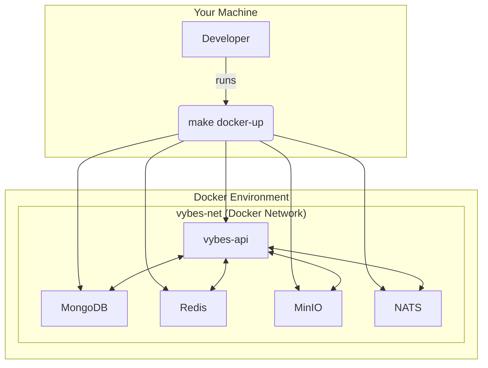

# Vybes Backend Architecture

This document outlines the architecture of the Vybes backend application. We follow the principles of Clean Architecture to create a system that is scalable, maintainable, and testable.

## Core Principles

*   **Separation of Concerns**: Each layer has a distinct responsibility. Handlers manage HTTP requests, Services contain business logic, and Repositories handle data access.
*   **Dependency Rule**: Dependencies flow inwards. The business logic (Services) does not depend on the presentation layer (Handlers) or the database implementation (Repositories).
*   **Decoupling**: Components are decoupled through interfaces and asynchronous communication (e.g., NATS for notifications), making the system more resilient and flexible.

## Local Development Environment (Docker Compose)

For local development, we use Docker Compose to orchestrate all the necessary services. This ensures a consistent and isolated environment for every developer. The `docker-compose.yml` file defines the entire stack.



## Production-Ready Architecture

The application is built as a stateless service, making it highly scalable and ready for clustering.

```mermaid
graph TD
    subgraph Client
        UserApp[User Application]
    end

    subgraph API Gateway / Load Balancer
        LB[Load Balancer]
    end
    
    subgraph API Cluster
        API1[vybes-api instance 1]
        API2[vybes-api instance 2]
        APIn[...]
    end

    subgraph Background Workers
        Cron[Cron Service (runs within an API instance)]
        NATS_Worker[NATS Worker (runs within an API instance)]
    end

    subgraph Backend Services (Shared)
        MongoDB[(MongoDB)]
        Redis[(Redis)]
        MinIO[(MinIO Storage)]
        NATS[("NATS Message Queue")]
        ResendAPI[Resend API]
    end

    UserApp --> LB
    LB --> API1 & API2 & APIn

    API1 & API2 & APIn --> MongoDB
    API1 & API2 & APIn --> Redis
    API1 & API2 & APIn --> MinIO
    API1 & API2 & APIn --> NATS
    API1 & API2 & APIn --> ResendAPI
```

### Key Components

*   **API Gateway / Load Balancer**: The entry point for all HTTP requests. It distributes traffic across multiple instances of the `vybes-api` service.
*   **API Cluster**: Multiple running instances of our stateless Go application, built from the `Dockerfile`. This allows for high availability and horizontal scaling.
*   **Handlers (Gin)**: Responsible for parsing HTTP requests, validating input, and calling the appropriate service methods.
*   **Services**: Contain the core business logic of the application.
*   **Repositories**: An abstraction layer for data persistence (MongoDB).
*   **Background Workers**:
    *   **NATS Worker**: Runs as a goroutine within each API instance, subscribing to the NATS queue to process asynchronous tasks like notifications.
    *   **Cron Service**: Runs as a goroutine within each API instance for scheduled tasks, like cleaning up expired stories.
*   **Backend Services**:
    *   **MongoDB**: The primary NoSQL database.
    *   **MinIO**: S3-compatible object storage for posts and stories, now in separate buckets.
    *   **Redis**: In-memory cache for performance optimization.
    *   **NATS**: A message queue for asynchronous communication.
    *   **Resend**: An external API service for sending transactional emails.